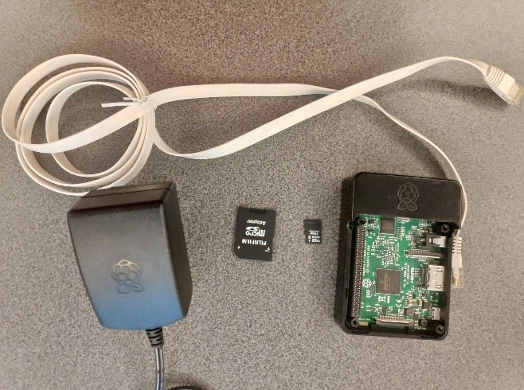
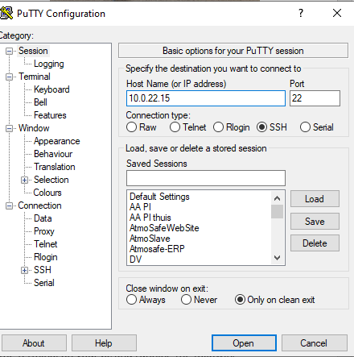
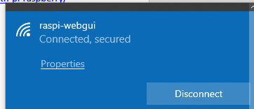
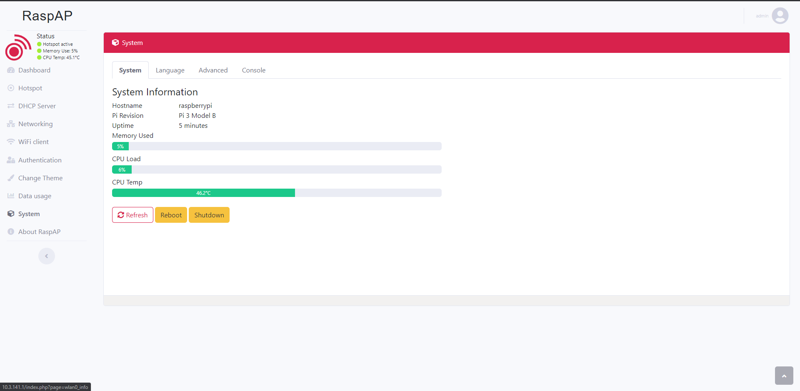
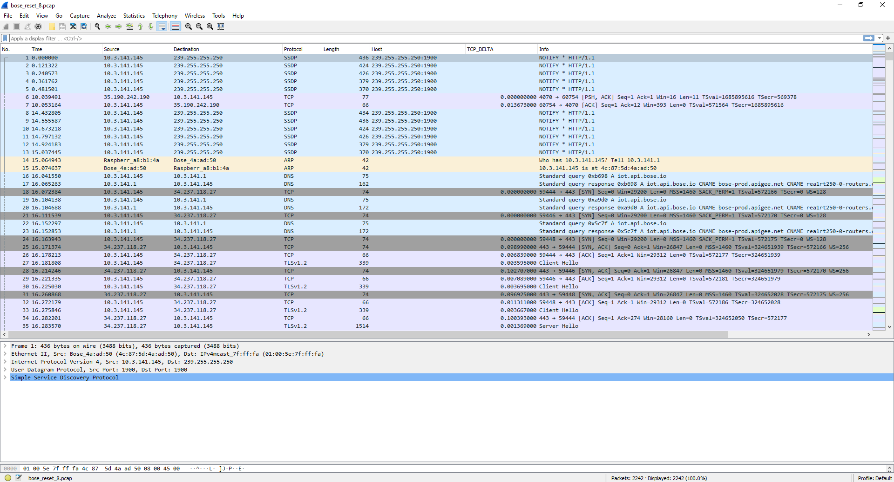

# Packet sniffer install guide

### Prerequisites


Requirements:

  * A raspberry pi 3 or newer
  * A power supply for your raspberry pi
  * A MicroSD card of at least 8GB
  * An Ethernet cables
  * A MicroSD Adapter (Optional)


###


### Raspberry Pi basic setup

Now that you have all your hardware, we should first start with installing Raspbian on your raspberry pi. This can easily be done by downloading Raspbian (preferably the lite version) from the official raspberry pi website:

[https://www.raspberrypi.org/downloads/raspbian/](https://www.raspberrypi.org/downloads/raspbian/)

Here you can click the download link for Raspbian Buster lite. You will also need a program to &quot;install&quot; the OS on your MicroSD. We used balenaEtcher. You can install this program by going to:

[https://www.balena.io/etcher/](https://www.balena.io/etcher/)

and downloading + installing the program. When the program is installed and the MicroSD is attached to your computer you can &quot;burn&quot; the OS by opening balenaEtcher. Click Select image and select the zip you just downloaded (Raspbian buster). Select the target (Your micro-SD) and click flash. Wait a couple of minutes until the program is ready.

Now you will have to open your micro-SD card&#39;s home folder. Add an empty file called SSH without an extension to enable SSH on your Raspberry Pi. Eject the SSD and insert it into your Raspberry Pi. Connect the pi to its power supply and the router.

You can find your raspberry pi&#39;s IP by opening the terminal on your pc and running the following command:

```shell
Ping raspberrypi
```

Once you obtain the IP from your Pi you can access it remotely by using Putty. You can download this program here: [https://www.putty.org/](https://www.putty.org/)

Open Putty, enter the IP from your raspberry pi, port 22 and select SSH. A new window will open. Accept the certificates and log in with username: pi and password raspberry



### Install RaspAP and hostapd

Open the terminal from your raspberry pi and run the following command:
```shell
sudo cp /etc/wpa\_supplicant/wpa\_supplicant.conf /etc/wpa\_supplicant/wpa\_supplicant.conf.sav

sudo cp /dev/null /etc/wpa\_supplicant/wpa\_supplicant.conf
```

Finally, edit in the file */etc/wpa\_supplicant/wpa\_supplicant.conf* and add the following lines:
```shell
ctrl\_interface=DIR=/var/run/wpa\_supplicant GROUP=netdev

update\_config=1
```

The Wi-Fi interface has now been made available.

Now we will install hostapd and a user-friendly interface by using RaspAP (for more info, go to [https://github.com/billz/raspap-webgui](https://github.com/billz/raspap-webgui))

The installation of RaspAP can easily be done by running a single command and following the steps shown in the terminal.

```shell
wget -q https://git.io/voEUQ -O /tmp/raspap &amp;&amp; bash /tmp/raspap
```

In our case there was the need for some extra configuration before the network became available. If it is already available, you can skip the following steps:

Open the following file:
```shell
sudo nano /etc/hostapd/hostapd.conf
```
And add the following line:
```shell
logger\_syslog=-1
```
Run the following command
```shell
sudo cat /var/log/syslog | grep hostapd
```
And:
```shell
sudo systemctl unmask hostapd

sudo systemctl enable hostapd

sudo systemctl start hostapd
```
restart your raspberry pi with the sudo reboot command.

### Connect to your Wi-Fi hotspot




Now a network called &quot;raspi-webgui&quot; should be available. When you connect to this Wi-Fi-network on your pc, you can access the interface by browsing to 10.3.141.1. (The default Wi-Fi password is ChangeMe ). The default username and password for the interface are:

Username: admin

Password: secret



The console can also be accessed by browsing to your Raspberry Pi&#39;s IP-address obtained in the first step (while connected to the same router).

### Installing TCPDump

The last step to creating a packet sniffer is installing TCPDump. This tool is installed with the following command:
```shell
Sudo apt-get install tcpdump
```

When the installation finishes you can start to capture traffic from every device connected to the network of your raspberry pi. We recommend capturing data by specifying your host and creating a pcap fie which later can be analyzed with Wireshark.

Example:
```shell
sudo tcpdump host 10.3.141.145 -i wlan0 -w test
```
This command captures all network packet going from and to the device 10.3.141.145 and creates a file called test.

Example pcap file:



Sources:

[https://howtoraspberrypi.com/create-a-wi-fi-hotspot-in-less-than-10-minutes-with-pi-raspberry/](https://howtoraspberrypi.com/create-a-wi-fi-hotspot-in-less-than-10-minutes-with-pi-raspberry/)

[https://danielmiessler.com/study/tcpdump/](https://danielmiessler.com/study/tcpdump/)
